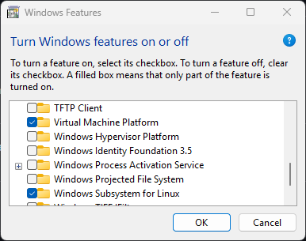
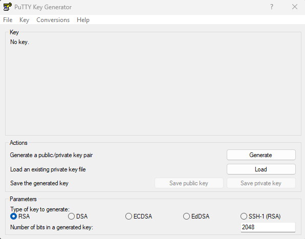
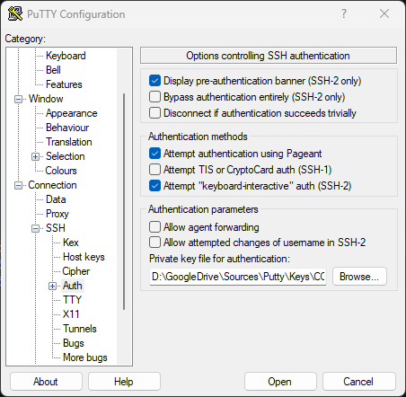
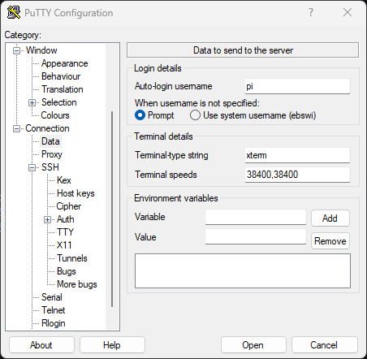
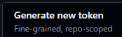
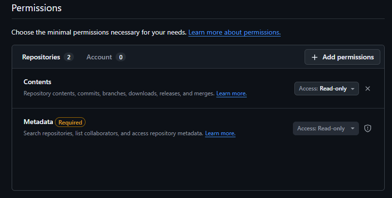

# NixDeploy
Prepared by Troy Simpson with requirements input from Dr Yufeng Lin.

\* Not for general release, contains endpoints.

NixDeploy is a general purpose deployment tool for Nix and NixOS on multiple platforms and operating systems using a single deployment script.

For the most part a pure NixOS deployment is less likely to break down over time with updates due to compatibility and dependencies.  Other platforms
will install reliably to a point but may break down in future with updates in dependencies, compatibility, and migration to new hardware and upgraded
base operating systems.  Due to hardware compatibility we have no option but to use different base operating systems, for example the NVidia Jetson AGX Xavier.

## General
###  VNC Viewer

NOTE: on Orin and some hosts, paste will work from middle mouse button into terminal through VNC Viewer.

NOTE: when connecting with VNC, leave out the port, just connect with hostname.duckdns.org.  Interestingly when connecting with port 5900 soon after a fresh reboot, Tars will connect with the port, but after some time it is unable to.  Connection can be re-established with the omission of the port.

####  Linux
For VNC Viewer deployment, install xtightvncviewer:

```console
sudo apt install xtightvncviewer
```

Run from terminal:

```console
vncviewer
```

####  Windows
TightVNCViewer:
https://www.tightvnc.com/download.php

##  Updating the Build in the GIT Repository
### First Commit
First time, skip if in doubt, it will advise to complete these two steps during commit, complete the steps and attempt the commit again:

```console
git config --global user.email “you@example.com”
git config --global user.name “your name”
```

### Modified Files
```console
git add “modifiedfile.ext”
git commit -m "modified file"
git push
```

## Preparing Hosts
This section covers preparation of our host for NixDeploy.

For deployment to a new host, find a similar pre-existing platform in the hosts sub-folder in this repository and copy it to a new host folder.  Modify
and add services, drivers and tools to suit the role of the new host.  Non-NixOS hosts must have service files placed into the common directory and if necessary
modifications made to the main install.sh.

###  Pure NixOS Initial Install
To install NixOS to a system, secure boot must be turned off to boot its USB installer.

During initial install, delete and overwrite any pre-existing partitions, select region and British English language, and US (Default) keyboard.

For your name use ‘pi’, and keep the auto-completed login name as ‘pi’.

Select XFCE for the desktop.

Check ‘Allow unfree software’.

Select Erase Disk.
Select Swap (no Hibernate) as the swap option.

Restart after completion and remove the installation media.

Select boot into NixOS.

Once “Reached target Graphical Interface” is displayed, it may freeze, otherwise it will show a login screen.  Press CTRL-ALT-F2 to go direct to the 
bash prompt, you will be prompted to login using the credentials you set.

###  NixOS on WSL
This isn’t particularly necessary for any step, it is a placeholder demonstrating how to install NixOS WSL.

Turn on Virtual Machine Platform and Windows Subsystem for Linux in Windows Features:



After they’re installed and the system rebooted, the latest WSL can be installed:

https://github.com/microsoft/WSL/releases

Download the latest NixOS WSL, and double click it to open with WSL.

###  SSH Public/Private Keys
We need to set the public keys up in the repo before the build so subsequent ssh logins can authenticate correctly from the get-go.

Run PuTTY Key Generator and click Generate with all the default options set (should appear as per below):



Save the resulting public key without any extension (we will overwrite this shortly).

Save the private key after answering ‘Yes’ to whether you want to save it without a passphrase.

In PuTTY Key Generator, copy the text produced in the Key text field.

Edit the public key file saved previously (the public key we saved initially is not correctly formatted for ssh authentication by default) and paste the copied key text over the saved key so that we preserve the correct formatting.  It will be one long key with no line breaks beginning with ‘ssh-rsa’ and ending with rsa-key-<date> (notepad might have word wrapping on so turn that off to check).

Edit the nix configuration for the host at the repo (remember, this is prior to machine deployment) so it will get implemented during the build.  Use an existing host as a template and replace the public key in this block:

```console
users.users.pi.openssh.authorizedKeys.keys
```

In putty, save a new profile for the host and select the private key file created earlier:




Set the auto login username:




Done, when you open the connection it will be logged in as user pi.

###  GitHub PAT

The GitHub PAT is used during a new deployment or change re-deployment on a target machine.

In GitHub, go to settings/tokens to create a github Personal Access Token (PAT):

https://github.com/settings/tokens

Use the dropdown to select fine grained token type



Set the expiry date.

Select the nixdeploy repository.

Add the Contents permission which will automatically add the Metadata permission, leave both at read only:




Click Generate Token:


Clone the repo using the new token:

```console
cd ~
git clone https://<github_pat_...>@github.com/<user>/<repo.git>
cd nixdeploy
```

###  Jetson AGX
Full NixOS deployment is complicated, initial testing demonstrates a working platform with no CUDA acceleration for the local LLM.

NOTE: The Jetson AGX Xavier does not have sufficient eMMC storage (32GB) to install JetPack and subsequent LLM models.  Use an onboard NVME for the initial JetPack installation.

#### Install Jetpack
From an existing ubuntu machine, deploy Jetpack to the xavier NVME over USB.  This will install the Jetpack version of Ubuntu 20.04.6 on a Xavier device, and 22.04.4 on an Orin device.

If it installs the OS but fails to install the SDK, then shutdown the device, move it to its own display, keyboard and mouse and boot the OS.  After login, install jetpack manually before installing nixdeploy:

```console
sudo apt update
sudo apt install nvidia-jetpack
```

#### Install Nix
Get the dependencies:

```console
sudo apt update
sudo apt install -y curl git ca-certificates
```

Install Nix:

```console
sh <(curl -L https://nixos.org/nix/install) --daemon
```

Accept defaults, let it create nixbld users.
Verify:

```console
nix --version
```

#### Display Manager
When prompted for the display manager during deployment steps, select lightdm.

## NixDeploy
This is our deployment to a new or existing host.  Both methods are executed in exactly the same manner with install.sh handling the installation.  When prepared correctly this deployment will work on a pure NixOS or non-NixOS host.

### Host Naming Convention

#### Short Name
This is the hostname that will exist on the network.

e.g.: tars

#### Long Name
The long name is the duckdns version, short names are unlikely to be available so the long name is suggested automatically during configuration and stored during the deployment.  At this stage it is simply the short name suffixed by ‘cqu’ which is unlikely to be already claimed.

e.g.

tarscqu

\* we don’t qualify the duckdns domain suffix here, we leave out the ‘.duckdns.org’.

DuckDNS can just use the long name with the token, we don’t need to qualify duckdns.org.

### New Host Preparation
To add a new host, following the above procedure to retrieve a local working copy of NixDeploy.

1. Create a new directory with the short name of the host
1. For NixOS, edit the new host configuration.nix, make required changes specific to the host.  Paste in the ssh public key
1. For non-NixOS install using our custom NixDeploy, modify install.sh to add the host to the case block for writing out the public key during install
1. Create a DuckDNS subdomain associated with the long name of the host described above.

### Deployment

#### Retry After Failed Deployment
If the deploy fails, then after resolving the issue return to the home directory and remove the temporary deployment files:

```console
cd ~
rm -rf /tmp/nixdeploy
```

The deployment can now be re-attempted.


#### Cleanup Old Deployments
Although this isn’t strictly required, if desired for some reason, reduce clutter on the boot screen selecting the deployment version, and save disk space:

First, boot into the desired version, then run this command:

```console
sudo nix-collect-garbage -d
```

#### Deploy or Re-Deploy
NixDeploy simply exists as a root folder on git containing all of our MASTER deployment configuration files.

Enter the ghp_ prefixed PAT provided by GitHub:

```console
GITHUB_PAT=<github PAT ghp_...>

nix --extra-experimental-features 'nix-command flakes' run nixpkgs#git clone https://${GITHUB_PAT}@github.com/ebswift/nixdeploy.git /tmp/nixdeploy && cd /tmp/nixdeploy && ./install.sh
```

During install you will be prompted for:

* Host: prompt user during install with a list of the host subdirectories stored under the hosts directory - the config files from the selected host subdirectory will be used during deployment
* DuckDNS subdomain: the long name
* DuckDNS token: our duckdns secret token, by providing it manually we avoid any problems associated with sharing deployment configuration files to other contributors
* VNC password: our secret VNC login password, as per the DuckDNS token we enter it manually to avoid any risk associated with sharing.

### Rebuilding
To avoid maintaining modifications outside of the github repository, do not modify/rebuild at the host using the standard nix-rebuild command.  Best practice here is to modify the deployment files and push the changes to the github repository.

To deploy the new changes to the host, re-run the deployment, it will iteratively update the system rather than full rebuild.  This will ensure rebuilding the host from scratch in future retains all modifications to the build.

## Tars Post-Deployment
### MQTT - Create Credentials

```console
sudo mkdir -p /etc/nixdeploy/secrets
```

Copy the following commands as a block and paste to run sequentially:
```console
sudo tee /etc/nixdeploy/secrets/mosquitto-admin-passwd > /dev/null <<'EOF'
<new mqtt admin password>
EOF
sudo chown root:root /etc/nixdeploy/secrets/mosquitto-admin-passwd
sudo chmod 600 /etc/nixdeploy/secrets/mosquitto-admin-passwd
sudo systemctl restart mosquitto
```

## Test Qwen

### Test Model Loaded Into Memory
Depending on the host configuration, different models will be loaded.  See the loaded model with:

```console
ollama ps
```

### Reduced VRAM Model Qwen3.5 9B
With thinking off:

```console
ollama run qwen3.5 --think=false "hi, please introduce yourself"
```

### Higher VRAM Qwen3.6 27B
With thinking off:

```console
ollama run qwen3.6 --think=false "hi, please introduce yourself"
```

## Test MQTT
Use the current password after the -P option:

```console
mosquitto_pub -h localhost -u admin -P '<MQTT password>' -t test/nodered -m "Hello from MQTT"
```

## Jetson Pure NixOS
Currently on hold but retaining work on the build for reference.

### Enter Recovery Mode
Use a good quality USB-C cable.  A direct USB-C connection from (e.g.) Tars seems to timeout and fail, a USB-A to USB-C cable appears to have worked so there may be some instability supporting the high speed onboard USB-C connection from Tars and possibly other machines.

Plugin the Jetson to the existing NixOS x86 machine using the USB-C connector beside the 40 pin header.

Plugin in the power, hold the middle (recovery) button and press the power button and release.  Keep holding the recovery button for a few seconds then release.
Deploying NixOS
From an existing NixOS installation:

```console
mkdir ~/iso && cd ~/iso
nix --extra-experimental-features nix-command --extra-experimental-features flakes build github:anduril/jetpack-nixos#iso_minimal_jp5

cd result/iso
# identify your USB (e.g. /dev/sda)
lsblk

# write to usb
sudo dd if=nixos-minimal-25.11.20260118.77ef7a2-aarch64-linux.iso bs=4M of=/dev/sda status=progress conv=fsync
```

Insert USB into Xavier.
Power on → press F11 or ESC at NixOS logo → Boot Manager → select the USB.
You will boot into a live environment that already has the jetpack module loaded and your config ready.

#### Set Partitions

```console
lsblk -o NAME,SIZE,TYPE,MOUNTPOINT
fdisk -l | grep -E 'Disk /dev|GPT'
```

In this case we can see /dev/nvme0n1 is the 1TB NVME drive that we installed.

```console
# Create GPT label
sudo parted /dev/nvme0n1 --script mklabel gpt

# EFI System Partition (512 MiB)
sudo parted /dev/nvme0n1 --script mkpart ESP fat32 1MiB 513MiB
sudo parted /dev/nvme0n1 --script set 1 esp on
sudo parted /dev/nvme0n1 --script name 1 boot

# Root partition (rest of the drive)
sudo parted /dev/nvme0n1 --script mkpart root ext4 513MiB 100%
sudo parted /dev/nvme0n1 --script name 2 nixos


sudo mkfs.fat -F 32 -n boot /dev/nvme0n1p1
sudo mkfs.ext4 -L nixos /dev/nvme0n1p2


sudo mount /dev/nvme0n1p2 /mnt
sudo mkdir -p /mnt/boot
sudo mount /dev/nvme0n1p1 /mnt/boot
```

Generate baseline configuration.nix (probably unnecessary at this point as it will be replaced):

```console
sudo nixos-generate-config --root /mnt
sudo nano /mnt/etc/nixos/configuration.nix
```

Paste the content:

```console
{ config, pkgs, ... }:

{
  imports = [  
    ./hardware-configuration.nix
    (builtins.getFlake "github:anduril/jetpack-nixos").nixosModules.default
  ];

  # Fix for libsecret test failure on Xavier
  nixpkgs.overlays = [
    (final: prev: {
      libsecret = prev.libsecret.overrideAttrs (old: {
        doCheck = false;
      });
    })
  ];

  networking.hostName = "xavier";
  networking.networkmanager.enable = true;

  boot.loader.grub.enable = true;
  boot.loader.grub.device = "nodev";
  boot.loader.grub.efiSupport = true;
  boot.loader.grub.efiInstallAsRemovable = true;

  hardware.nvidia-jetpack.enable = true;
  hardware.nvidia-jetpack.som = "xavier-agx";
  hardware.nvidia-jetpack.carrierBoard = "devkit";
  hardware.nvidia-jetpack.majorVersion = "5";

  # graphics
  boot.kernelParams = [ "fbcon=map:2" "console=tty0" ];
  services.xserver.enable = true;
#  services.xserver.videoDrivers = [ "modesetting" ];
  services.xserver.videoDrivers = [ "nvidia" ];
  hardware.nvidia.modesetting.enable = true;
  hardware.nvidia-jetpack.modesetting.enable = true;

  services.xserver.desktopManager.xfce.enable = true;
  services.xserver.displayManager.lightdm.enable = true;
#  services.xserver.displayManager.sddm.enable = true;

  nixpkgs.config.allowUnfree = true;

  users.users.nixos = {
    isNormalUser = true;
    extraGroups = [ "wheel" "networkmanager" "video" ];
    initialPassword = "nixos";
  };
  security.sudo.wheelNeedsPassword = false;

  system.stateVersion = "25.11";  
}
```

#### Install

```console
sudo nixos-install
```
